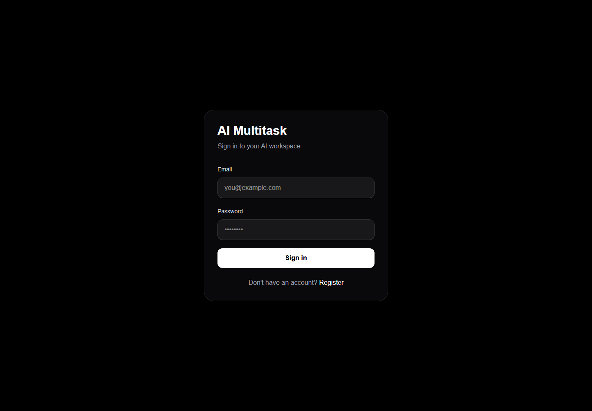
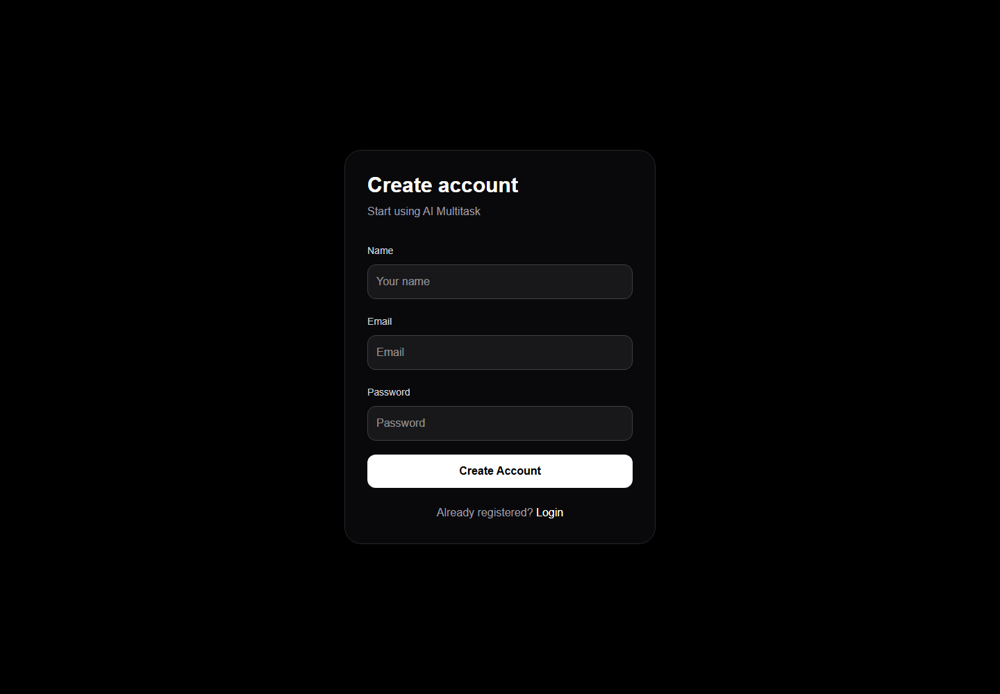
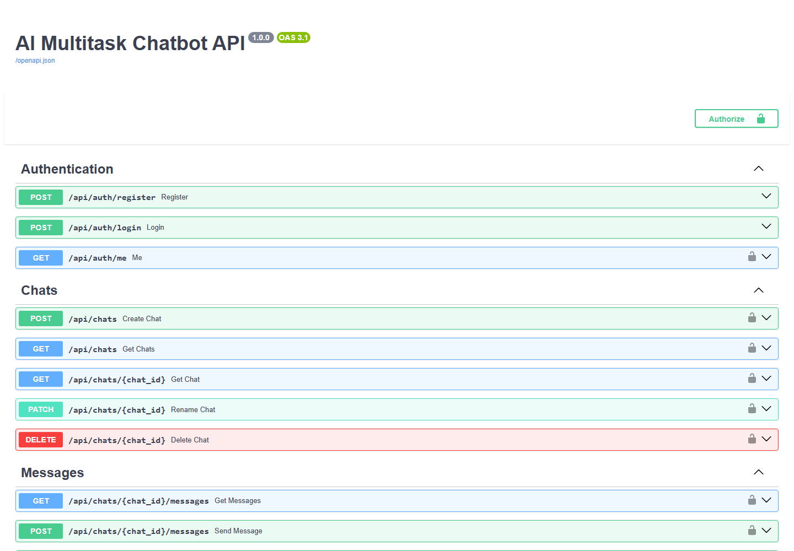
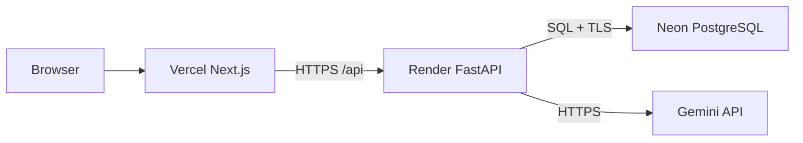

# AI Multitask Chatbot

Production-oriented FastAPI, Next.js, PostgreSQL, and Gemini application with
streamed chat, GitHub-flavored Markdown, bounded multitask execution, document
analysis, failure recovery, and managed-cloud deployment configuration.

Repository: https://github.com/pavanpatil76005/AI-Multitask-Chatbot-

## Screenshots

<p align="center">
  
  
  
</p>

These images were captured from the local production build. Cloud URLs are
recorded below after provider authentication.

## Features

- Registration, login, current-user lookup, and Bearer authentication.
- New chat, rename, pin, archive, delete, and full-text conversation search.
- Streaming Gemini answers with Thinking, Stop, partial persistence, and retry
  without duplicating the user message.
- Safe GFM Markdown rendering for headings, bold text, lists, tables, code, and
  separators; unsafe HTML/URLs and remote tracking images are blocked.
- AI task planning with up to eight independent tasks, three concurrent provider
  calls, per-task progress, cancel, retry, 180-second deadlines, and one combined
  assistant answer.
- Startup and periodic recovery so interrupted streams/tasks become retryable
  instead of remaining `generating`/`in_progress` indefinitely.
- PDF, CSV, TXT, and Markdown extraction and analysis with ownership checks.
- CSV statistics and a 5 MB / 40,000-character / 50-page PDF boundary.
- Edit question, edit answer, regenerate, copy, delete failed response, and
  logout/login flows.
- Docker, Docker Compose, Render Blueprint, Vercel configuration, and GitHub CI.

## Architecture



See [architecture](docs/architecture.md), [database](docs/database.md), and
[cloud deployment](docs/cloud-deployment.md).

## Technology

| Area | Technology |
| --- | --- |
| Frontend | Next.js 16, React 19, TypeScript, Tailwind CSS |
| Markdown | `react-markdown` + `remark-gfm` |
| Backend | FastAPI, Pydantic Settings, SQLAlchemy 2, Alembic |
| Database | PostgreSQL (local or Neon) |
| AI | Google Gemini with retries and model fallbacks |
| Hosting target | Vercel frontend, Render backend, Neon database |
| CI | GitHub Actions with PostgreSQL service |

## API summary

All `/api/*` routes require `Authorization: Bearer <token>`.

| Method | Route | Purpose |
| --- | --- | --- |
| `POST` | `/api/auth/register` | Create account |
| `POST` | `/api/auth/login` | Issue access token |
| `GET` | `/api/auth/me` | Current user |
| `POST/GET` | `/api/chats` | Create/list/search chats |
| `GET/PATCH/DELETE` | `/api/chats/{id}` | Read/rename-pin-archive/delete chat |
| `GET/POST` | `/api/chats/{id}/messages` | History/non-stream answer |
| `POST` | `/api/chats/{id}/messages/stream` | SSE answer |
| `DELETE` | `/api/chats/{id}/messages/{mid}` | Delete failed response |
| `POST` | `/api/chats/{id}/messages/{mid}/retry` | Retry answer |
| `POST` | `/api/chats/{id}/messages/{mid}/stop` | Stop generation/tasks |
| `POST` | `/api/chats/{id}/messages/{mid}/regenerate` | Regenerate latest answer |
| `PATCH` | `/api/chats/{id}/messages/{mid}` | Edit assistant answer |
| `POST` | `/api/chats/{id}/messages/{mid}/edit` | Edit question and regenerate |
| `POST/GET/PATCH` | `/api/chats/{id}/tasks[/{tid}]` | Create/list/update task |
| `POST` | `/api/chats/{id}/tasks/plan` | AI plan |
| `POST` | `/api/chats/{id}/tasks/run` | Run/retry plan |
| `POST` | `/api/chats/{id}/tasks/{tid}/retry` | Retry one task |
| `POST` | `/api/chats/{id}/tasks/cancel` | Cancel active run |
| `POST/GET` | `/api/files` | Extract/list attachments |
| `GET` | `/health/database` | Database health |

Interactive OpenAPI documentation is available at `/docs`.

## Local setup

Prerequisites: Python 3.13, Node.js 22, npm, and PostgreSQL.

```powershell
# PostgreSQL (project-local server)
& ./.local/pgsql/bin/pg_ctl.exe -D ./.local/pgdata -l ./.local/postgresql.log -w start

# Backend
cd backend
.\.venv\Scripts\python.exe -m pip install -r requirements.txt
.\.venv\Scripts\python.exe -m alembic upgrade head
.\.venv\Scriptsastapi.exe dev app/main.py --port 8001
```

Create `backend/.env` from `backend/.env.example`. Never commit it.

```powershell
# Frontend, second terminal
cd frontend
npm ci
npm run dev
```

Open:

- Frontend: http://localhost:3000
- API docs: http://127.0.0.1:8001/docs
- DB health: http://127.0.0.1:8001/health/database

## Verification

```powershell
cd backend
.\.venv\Scripts\python.exe -m pip check
.\.venv\Scripts\python.exe -W error::ResourceWarning -m unittest discover -s tests -p "test_*.py"
.\.venv\Scripts\python.exe -m alembic check

cd ../frontend
npm test
npm run lint
npx tsc --noEmit --incremental false
npm run build
```

The suite is verified against PostgreSQL and rolls back its rows. Real-provider
scripts are available in `backend/verify_*.py` and consume Gemini quota.

## Docker

```powershell
cd backend
docker build -t ai-multitask-backend .
docker run --rm -p 8001:8000 --env-file .env ai-multitask-backend
```

Open http://127.0.0.1:8001/docs. The container runs migrations before Uvicorn,
uses a non-root user, exposes port 8000, and has a database health check.

For the full local stack:

```powershell
Copy-Item deployment.env.example deployment.env
# Fill every placeholder secret.
docker compose --env-file deployment.env up --build -d
```

## Cloud deployment

Follow [cloud deployment](docs/cloud-deployment.md):

1. Create Neon PostgreSQL and copy its pooled `DATABASE_URL`.
2. Deploy the Render Blueprint from `render.yaml`.
3. Import the repository into Vercel with root directory `frontend`.
4. Set `NEXT_PUBLIC_API_URL` to the Render URL.
5. Add the Vercel origin to Render's `CORS_ORIGINS` and redeploy.

| Component | URL | Status |
| --- | --- | --- |
| GitHub | https://github.com/pavanpatil76005/AI-Multitask-Chatbot- | Live/public |
| Neon | `DATABASE_URL` | Pending authenticated Neon session |
| Render backend | `https://YOUR-BACKEND.onrender.com` | Pending authenticated Render session |
| Vercel frontend | `https://YOUR-APP.vercel.app` | Pending authenticated Vercel session |

Provider tokens and cloud secrets are not present on this machine, so the final
three external account operations cannot be completed non-interactively.

## Security

- `backend/.env`, `frontend/.env.local`, `deployment.env`, `.venv/`,
  `node_modules/`, `.next/`, `.local/`, and PostgreSQL data are ignored.
- Only `.env.example` templates are tracked.
- CI runs dependency, migration, backend, and frontend checks on every push/PR.
- Passwords use Argon2; JWT secrets and Gemini keys remain provider-side.
- CORS is an explicit origin allowlist; do not use `*` with credentials.
- Original uploaded bytes are not stored.

## Limitations

- Cloud URLs are pending provider authentication.
- Docker is not installed on the current machine, so the image could not be built
  locally here; CI/Docker configuration is included.
- The task executor is in-process. Use one API process unless an external durable
  queue and worker ownership are added.
- Scanned PDFs require OCR, which is not implemented.
- The Gemini provider performs text reasoning only; it does not browse or run
  generated code.

## Conclusion

The repository is production-configured and verified for local PostgreSQL use.
All application, recovery, security, container, CI, and deployment-manifest work
is complete. Remaining work is limited to authenticating Neon, Render, and
Vercel, entering their secrets, and running the final deployed smoke test.
