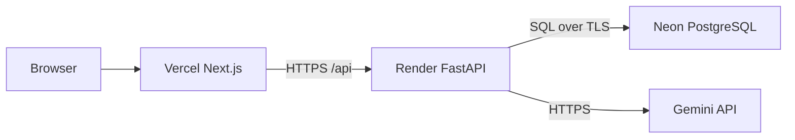

# Architecture

## Cloud topology

- **Vercel** serves the static/Next.js frontend. `NEXT_PUBLIC_API_URL` points to Render.
- **Render** runs the FastAPI container. Startup runs `alembic upgrade head`, then
  starts one Uvicorn process on Render's `PORT` (8000 locally).
- **Neon** stores users, chats, messages, tasks, runs, and extracted attachment
  metadata/text. Use its pooled or direct PostgreSQL URL in `DATABASE_URL`.
- **Gemini** performs answer generation, planning, and task execution. The backend
  applies SDK retries and configured model fallbacks.

## Backend layers

| Layer | Location | Responsibility |
| --- | --- | --- |
| API | `backend/app/api` | Auth, chat, message, task, and upload endpoints |
| Schemas | `backend/app/schemas` | Pydantic validation and response contracts |
| Models | `backend/app/models` | SQLAlchemy PostgreSQL mappings |
| AI gateway | `backend/app/ai` | Gemini retries, streaming, and model fallback |
| Services | `backend/app/services` | Planning, aggregation, lifecycle, attachments |
| Database | `backend/app/core` | Settings, engine, sessions, UTC helper |

## Request flows

### Streamed answer

1. The frontend sends a Bearer-authenticated message request.
2. FastAPI serializes turns per chat, creates user/assistant rows, and returns SSE.
3. Gemini chunks stream to the browser while a guarded attempt writes the answer.
4. Disconnect or Stop persists the partial result as `interrupted`; Retry reuses the
   same rows rather than duplicating the question.

### Multitask plan

1. The planner produces 1–8 validated independent tasks.
2. `task_runs` and `tasks` are persisted before provider execution.
3. Up to three Gemini calls execute concurrently; each result/error is stored.
4. A 180-second deadline and generation tokens prevent stale writes.
5. Completed task sections are assembled into exactly one assistant message.
6. Startup and 30-second recovery sweeps fail or interrupt abandoned work so it is
   retryable rather than indefinitely `in_progress`/`generating`.

### Attachments

1. The API enforces a 5 MB size limit and PDF/CSV/TXT/Markdown type rules.
2. Text is extracted in memory; original file bytes are never stored.
3. Ownership-checked attachment metadata and extracted text are persisted.
4. PDF is limited to 50 pages and scanned PDFs without text are rejected.
5. CSV numeric columns receive computed count/highest/average/total values.

## Deployment boundaries

The executor uses in-process threads. Run **one API process** unless worker
ownership and a durable external queue are added. Render's container entrypoint
runs migrations before Uvicorn; the Compose deployment uses a separate migration
service and gates the API on its success.
